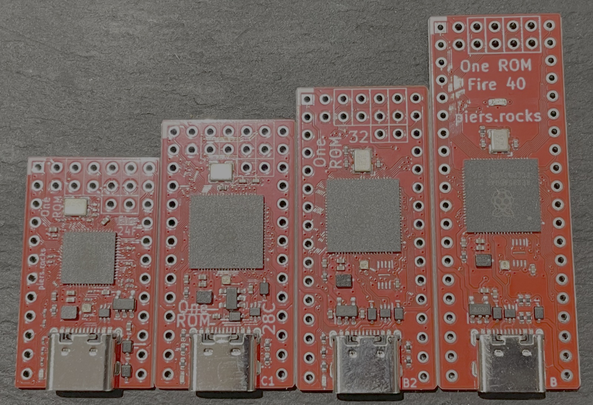
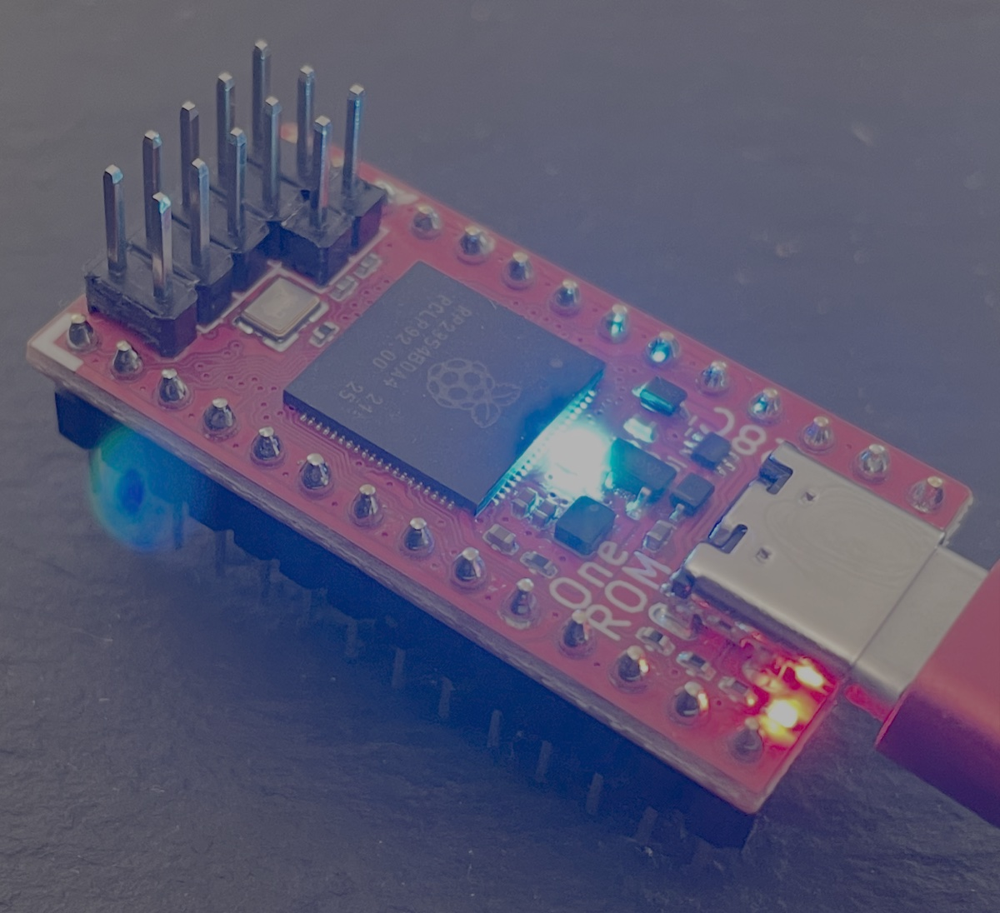
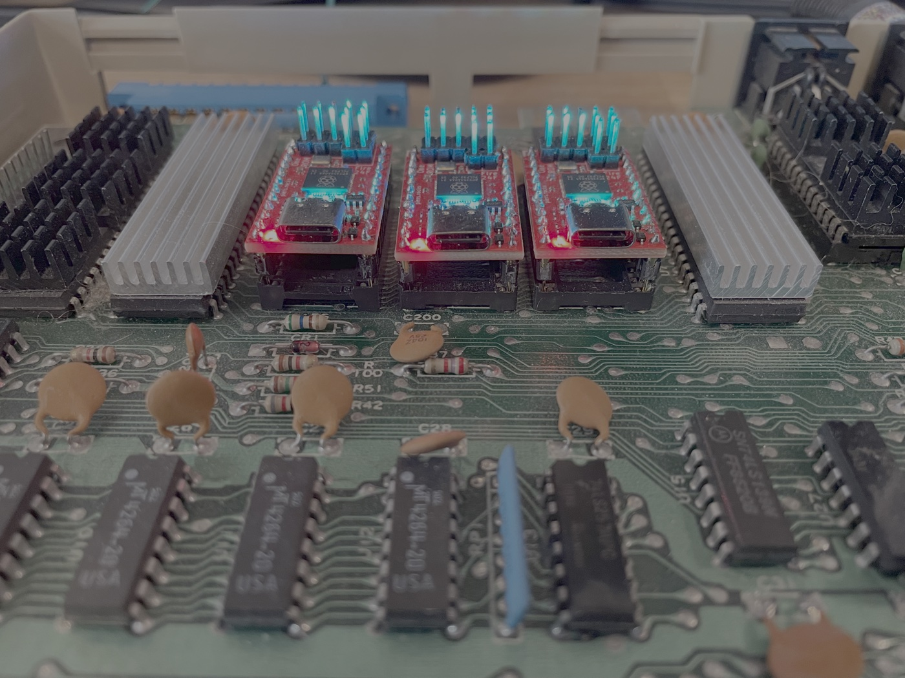
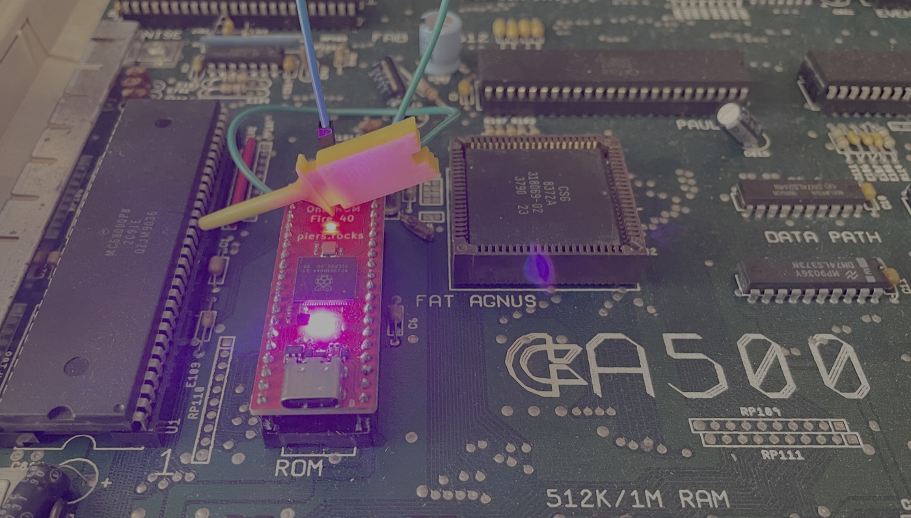

# One ROM

**[One ROM](https://onerom.org) - One ROM To Rule Them All**

The most flexible and powerful ROM replacement for your retro computer.  A single Raspberry Pi
RP2350-base board in the footprint of the original chip emulates 24, 28, 32 and
40 pin mask ROMs, EPROMs, EEPROMs, bipolar PROMs and some SRAM — and then does
things the original never could.  It serves several ROM sockets at once, switches
images at runtime, reprograms over USB without leaving the socket, talks back to
the machine it is installed in, and runs your own code as plugins.

Thousands of One ROMs are installed in Commodore 64s, VIC-20s, PETs, Amigas, BBCs, Ataris, TIs, Apple IIs,
disk drives, IBM PCs, pinball machines, drum machines, synthesizers and more.  It is
open source hardware and software, it is cheap to make, and it is actively
maintained and developed.

## New to One ROM?

**Start at [onerom.org](https://onerom.org).**  That is where the project is
explained and supported:

- [What One ROM is and why](https://onerom.org) — the overview, with pictures
- [Getting started](https://onerom.org/start/) — install it, program it, use it
- [Buy one](https://onerom.org/buy) — known vendors, if you'd rather not fab
  your own
- [Program from your browser](https://onerom.org/web) — no software to install

**The rest of this README is for people who want to build One ROM, hack on it,
or build things on top of it.**  If you just want a working ROM replacement, [onerom.org](https://onerom.org) will get you there faster.

## Ways in

One ROM is designed to be extended in many different ways.

| I want to… | Start here | Steps |
|------------|------------|------------|
| Drive a device from scripts or my own tooling | [Programming a One ROM](#programming-a-one-rom), [CLI manual](docs/CLI-MANUAL.md) | Install and run the CLI |
| Fab and assemble existing boards | [hardware/pcb](hardware/pcb/README.md) | Upload gerbers and BOM/POS files to a fab |
| Build the firmware myself | [Building from source](#building-from-source) | Use `make` or the build container |
| Use the header pins as GPIOs — reset the host, drive a line | [Driving the host](#driving-the-host--gpio-and-reset) | One command, plus a wire for host reset |
| Add support for a chip type One ROM doesn't know | [Adding a chip type](docs/ADDING-CHIP-TYPES.md) | A JSON entry plus one line of Rust or a firmware and tooling update if no existing serving algorithm fits |
| Add support for a new board revision | [rust/config/json](rust/config/json/README.md) | A new JSON file once the board is designed |
| Write a plugin — from scratch, or from a working one | [Plugins](#plugins), [firmware/ora/examples](firmware/ora/examples) | C, against a stable API |
| Talk to the retro machine from the ROM socket | [RBCP](#rbcp--talking-to-the-host-system) | 6502 and 68000 host code provided |
| Build host-side tools of my own | [Rust crates](#rust-crates) | Rust, on published crates |
| Read and test real ROM chips | [One ROM Lab](#one-rom-lab) | Flash Lab to a spare Fire board |
| Add a serving algorithm, or change how serving works | [How the firmware works](#how-the-firmware-works) | Bare metal C, PIO and DMA, plus Rust tooling |
| Design a new board | [hardware/pcb](hardware/pcb/README.md) | KiCad |

## Hardware

One ROM comes in two families:

- **Fire** — RP2350, in 24, 28, 32 and 40 pin variants, latest boards include an
  RGB NeoPixel.  All development happens for these boards.
- **Ice** — STM32F4, 24 pin only.  Legacy: still supported with 0.6.x firmware,
  but it is not being enhanced.  The 0.7.x firmware and the CLI do not
  support it.

<div align="center">
    
</div>

<div align="center">
    
</div>

All the design files needed to manufacture your own are in
[hardware/pcb](hardware/pcb).  Start with the
[recommended revisions](hardware/pcb/README.md#recommended-revisions) and
read the fabrication notes in the same file before you order.  Boards can be
fabbed and assembled at JLCPCB and other manufacturers cheaply.

<div align="center">
    
</div>

<p align="center"><em>Three One ROM Fire 24s in a Commodore 64, serving BASIC,
KERNAL and the character ROM.</em></p>

## Programming a One ROM

There are three tools, all doing the same job over USB:

- **[One ROM Web](https://onerom.org/web)** — browser based, nothing to install,
  the best choice for most people.
- **[One ROM CLI](https://onerom.org/cli)** — the full device tool, and what the
  examples below use ([rust/cli](rust/cli)).
- **[One ROM Studio](https://onerom.org/studio)** — native desktop GUI for
  Windows, macOS and Linux ([rust/studio](rust/studio)).

The CLI is the complete interface: everything the device can do is reachable from
it.  Full reference in the [CLI manual](docs/CLI-MANUAL.md).

Find what is connected:

```bash
onerom scan
```

Build an image from a config file and flash it:

```bash
onerom program --config onerom-config/vic20-pal.json
```

Program chips straight from the command line, without a config file, adding the
USB plugin so the device stays on the bus while it serves:

```bash
onerom program --slot file=kernal.901227-03.bin,type=2364,cs1=active-low --plugin usb
```

Build a firmware binary without touching a device, and look inside one:

```bash
onerom firmware build --config onerom-config/vic20-pal.json --board fire-24-e --output /tmp/onerom.bin
onerom firmware inspect --firmware /tmp/onerom.bin
```

Read and write the ROM image live, while the host is running from it:

```bash
onerom peek live --address 0x100 --length 64
onerom poke live --address 0x100 --byte 0xEA
```

## Driving the host — GPIO and reset

The image select and X pads are not just jumpers.  They are GPIOs, and
One ROM will drive them for you — which means the ROM socket becomes a way to
manipulate the machine it is plugged into.

Run a wire from a pad to the host's reset line and you can reset the machine
after flashing a new image:

```bash
onerom control reset --pin sel_c
```

`sel_c` is the usual choice — more boards have it than have X pads, and it is 5V
tolerant where it exists.  Any pad works, named with `--pin`.

<div align="center">
    
</div>

<p align="center"><em>A One ROM Fire 40 in an Amiga A500, with <code>Sel_C</code>
wired to the 68000's reset line.</em></p>

You can see what every pin is and what it is currently doing:

```bash
onerom inspect gpio --all
onerom inspect socket --chip-type 2364 --gpio
```

The same GPIOs are available to plugins, so a plugin can drive them
autonomously — hold the host in reset until something is ready, blink an
external LED on ROM activity, or drive whatever you have wired up.

## Plugins

Serving runs entirely on PIO and DMA, so both CPU cores are free.  Plugins are
separate binaries, written in C against a stable API in
[firmware/ora](firmware/ora), that run on those cores *while serving continues*.
Two run at once.  This is how One ROM gains functionality without needing to
fork the core firmware.

There are two types, **system** and **user**.  The difference is resources, not
authorship — each is built for a different flash slot with a different RAM and
stack allocation, and you can write either.  System is intended for official One
ROM plugins such as the USB stack, but nothing stops you replacing it with your
own.

| Plugin | Type | What it does |
|--------|------|--------------|
| [usb](plugins/system/usb) | system | The device's own USB stack, so a running One ROM stays on the bus.  Exposes the ROM being served for live read and write, and the `picobootx` extended PICOBOOT interface. |
| [host-control](plugins/user/host-control) | user | A full [RBCP](#rbcp--talking-to-the-host-system) implementation. |
| [rgb](plugins/user/rgb) | user | Cycles the NeoPixel on RGB boards. |
| [activity](plugins/user/activity) | user | Blinks the status LED when the host is reading the ROM. |
| [blink](plugins/user/blink) | user | Minimal example. |

The firmware passes each plugin a lookup function at startup.  The plugin calls
it with the ID of the facility it wants, and gets back a function pointer.
Available that way: status LED and GPIO control, device and firmware metadata,
logging, memory allocation, the ROM and RAM slots being served, and the address
monitor that reports what the host is reading — which is what RBCP is built on.
New IDs are only ever added, never changed, and each plugin declares the minimum
firmware version it needs, which the firmware enforces before launching it.

Start with [plugins/README.md](plugins/README.md) for how plugins are built and
configured, [firmware/ora/api.h](firmware/ora/api.h) for the API, and
[firmware/ora/examples](firmware/ora/examples) for worked examples — including
one that patches the C64 kernal live and one that drives an LED from character
ROM accesses.

## RBCP — talking to the host system

The [ROM Bus Control Protocol](https://github.com/piersfinlayson/rom-bus-control-protocol)
is bidirectional communication between a retro machine and the ROM emulator
installed in it, carried over nothing but the ROM's own address and data buses.
No extra wiring.  The machine reads and writes ROM addresses, and One ROM
interprets them.

That opens up things a ROM socket has no business being able to do:

- remote debugging of code running on real hardware
- ROM-based bootloaders — `grub` for the C64
- dynamic patching of games and demos as they run

The device side is the [host-control](plugins/user/host-control) plugin.  The
specification lives in the RBCP repository, along with reference host
implementations for 6502 and 68000 — generic routines plus sample C64 kernal and
Amiga Kickstart bootloaders.

## One ROM Lab

[One ROM Lab](rust/lab/README.md) is alternate firmware for a spare Fire board that turns
its ROM socket into a bus reader and tester.  Flash it, connect over USB, and you
get an interactive shell.

Read a real chip in the socket, as a checksum, a hexdump or Intel HEX.  Verify
that a One ROM under test serves the right bytes and tristates its data lines
when deselected.  Auto-detect chip select polarity on an unmarked mask ROM by
brute-forcing the combinations.  Dump the board's pin map, socket pin to signal
to GPIO.  It is what Fire 40 boards are tested with before they ship.

```bash
cd rust/lab && scripts/flash.sh
```
## Building from source

Dependencies are listed in [INSTALL.md](INSTALL.md), or use the
[build container](ci/docker/README.md).  The ARM and
Emscripten toolchain versions are pinned (`ci/arm-toolchain-version`,
`ci/emscripten-version`) so a firmware binary is byte-identical wherever it is
built.

Build the base firmware:

```bash
make
```

That produces `firmware/build/onerom-rp235x.bin` — one binary, for every Fire
board.  The ROM images, chip configuration and plugins are composed onto it by
the host-side tools.  To flash *your* build rather than a downloaded release,
pass it explicitly:

```bash
onerom program --config onerom-config/vic20-pal.json --base-firmware firmware/build/onerom-rp235x.bin
```

## How the firmware works

Worth knowing before you go digging in [firmware/](firmware):

**It is fully bare metal.**  No SDK, no HAL — not pico-sdk, not a vendor library.
C with its own startup code and its own linker scripts to keep it lean.

**Serving runs on PIO and DMA.**  The RP2350's PIO state machines watch the
address and chip select lines and DMA the right byte onto the data pins.  The CPU
is not in the critical path, which is what leaves both cores free for plugins.

**The chip type is not compiled in.**  The firmware knows nothing about a 2364 or
a 27C400.  It has a small set of parameterised serving algorithms, and the
host-side generator works out which algorithm and what arguments a given chip on
a given board needs, then writes that into the firmware metadata.

**It is one binary for all boards.**  Board differences are metadata too.

**Bad configuration is visible, not silent.**  An image the firmware cannot make
sense of drops it into limp mode, with an special LED blink pattern.

**The PIO programs are assembled on the device, at boot.**  Which program is
needed depends on the chip, the board's pin mapping and the configuration in
flash, none of which are known at build time.
[apio](https://github.com/piersfinlayson/apio) assembles them in C at runtime,
and disassembles them so a generated program can be read back and checked.

## Regression tested off-hardware

Every push runs the **real firmware C** — the source that ships on devices, not a
model of it — compiled for the host and linked against
[epio](https://github.com/piersfinlayson/epio), a cycle-exact RP2350 PIO
emulator, then driven over emulated bus cycles.

The sweep is hundreds of test runs covering all Fire board revisions, all supported
chip types, every configuration shape the firmware offers — single, banked,
multi-chip, 16-bit — and every chip select polarity combination.  Every address
of every image is compared against an independent copy, which is 10s of
millions of byte-level comparisons, plus checks that the data bus tristates for every
non-selected control line combination.

The plugin API is covered down to all API IDs, and the host-control plugin's own C source is run against a full suite of
conformance tests whose basis is the protocol specification rather than the
implementation.

CS-to-data latency is asserted to the exact cycle in **both**
directions, so serving getting a cycle slower — or a cycle faster, which would
mean the check had stopped discriminating — fails the build.

What it does not do today is anything analogue — voltage levels, bus loading,
propagation delay at a real pin — or USB.  Those need a board, which is what
[One ROM Lab](#one-rom-lab) is for.

## Rust crates

The host-side tooling is a Cargo workspace in [rust/](rust).  The crates marked
published are on crates.io, for host-side Rust development.

| Crate | Published | What it is for |
|-------|:---------:|----------------|
| [`onerom-gen`](rust/gen) | ✓ | Generates ROM images and firmware metadata.  The heart of the toolchain — turns a config plus some ROM files into something flashable. |
| [`onerom-config`](rust/config) | ✓ | The config model: chip types, board definitions, pin maps, JSON schema. |
| [`onerom-fw`](rust/fw) | ✓ | Composes a complete firmware image, resolving and fetching base firmware from the release manifest. |
| [`onerom-fw-parser`](rust/fw-parser) | ✓ | Reads metadata back out of a firmware binary — what chips, what board, what version. |
| [`onerom-metadata`](rust/metadata) | ✓ | The embedded metadata schema itself. |
| [`onerom-cli`](rust/cli) | ✓ | Everything the CLI does, minus the command line parsing.  Build on it rather than reimplementing USB device logic. The CLI binary is released at [onerom.org/cli](https://onerom.org/cli). |
| [`onerom-app`](rust/app) | ✓ | Transport-free logic shared by the CLI, Studio and the web tools. |
| [`onerom-studio`](rust/studio) | | The desktop GUI, released at [onerom.org/studio](https://onerom.org/studio). |
| [`onerom-lab`](rust/lab) | | One ROM Lab, above. |
| [`onerom-lens`](rust/lens) | | One ROM Lens — compiles the firmware emulator to WebAssembly and draws PIO and DMA activity as waveforms in a browser, cycle by cycle. |
| [`onerom-fw-emulator`](rust/fw-emulator) | | Compiles and runs the real firmware C on a host, PIOs and all. |
| [`onerom-fw-tester`](rust/fw-tester) | | Drives the emulator with generated configurations and checks the results. |
| [`onerom-plugin-tester`](rust/plugin-tester) | | Runs plugins against the emulated firmware. |
| [`onerom-fw-driver`](rust/fw-driver), [`onerom-fw-geometry`](rust/fw-geometry) | | Pin geometry and GPIO bitmask helpers, shared and dependency-free by design. |
| [`fw-config-gen`](rust/fw-config-gen), [`schema-gen`](rust/schema-gen) | | Code and schema generators. |

For in-browser use, [one-rom-wasm](https://github.com/piersfinlayson/one-rom-wasm)
wraps `onerom-gen` as WASM, and is what the
[browser programmer](https://onerom.org/web) in
[one-rom-site](https://github.com/piersfinlayson/one-rom-site) is built on.

## What is in this repository

| Directory | Contents |
|-----------|----------|
| [`firmware/`](firmware) | The core firmware: C and Thumb assembly, bare metal.  `ora/` is the plugin API. |
| [`plugins/`](plugins) | System and user plugins. |
| [`rust/`](rust) | The Cargo workspace — CLI, Studio, generators, emulator, Lab, Lens. |
| [`hardware/pcb/`](hardware/pcb) | KiCad designs, per board revision, verified and unverified. |
| [`onerom-config/`](onerom-config) | Ready-made JSON configs for some common systems, and the config schema. |
| [`docs/`](docs) | Documentation, including the generated chip and compatibility references. |
| [`ci/`](ci) | Build, test and lint scripts, and the reproducible build container. |
| [`images/`](images) | Test ROM images. |
| [`demo/`](demo) | Demonstration programs for the retro side. |

## Documentation

| Topic | Description |
|-------|-------------|
| [CLI Manual](docs/CLI-MANUAL.md) | Complete reference for the `onerom` command line tool. |
| [Chip Types](docs/CHIP-TYPES.md) | Every chip type One ROM knows about, with pinouts and control lines. |
| [Compatibility](docs/COMPATIBILITY.md) | Which chips each hardware variant can emulate, and at what flash cost. |
| [Adding a Chip Type](docs/ADDING-CHIP-TYPES.md) | Teaching One ROM to emulate a chip it does not yet know. |
| [Image Selection](docs/IMAGE-SELECTION.md) | Telling One ROM which installed image to serve. |
| [Image Sets](docs/MULTI-ROM-SETS.md) | Serving several ROMs at once, and dynamic bank switching. |
| [Plugins](plugins/README.md) | Building, configuring and writing plugins. |
| [Build Container](ci/docker/README.md) | Building the firmware reproducibly in Docker. |
| [ROMs Glorious ROMs](docs/ROMS-GLORIOUS-ROMS.md) | Everything you wanted to know about 23/27 series ROMs but were afraid to ask. |
| [Changelog](CHANGELOG.md) | What changed, and when. |

More in [docs/](docs) — flash layout, logging, voltage levels, using a Pi Pico as
an SWD programmer — plus [INSTALL.md](INSTALL.md) for build dependencies and
[LICENSE.md](LICENSE.md).

## Videos

Why use One ROM:

[](https://www.youtube.com/watch?v=LjKZ0uKzLO4)

The hardware family:

[](https://www.youtube.com/watch?v=GAh021jgGgs)

## Related repositories

| Repository | What it is |
|------------|------------|
| [rom-bus-control-protocol](https://github.com/piersfinlayson/rom-bus-control-protocol) | The RBCP specification, and 6502/68000 reference host implementations. |
| [one-rom-site](https://github.com/piersfinlayson/one-rom-site) | onerom.org, including the browser programmer. |
| [one-rom-images](https://github.com/piersfinlayson/one-rom-images) | images.onerom.org — firmware images, configs, plugin manifests. |
| [one-rom-wasm](https://github.com/piersfinlayson/one-rom-wasm) | WASM build of `onerom-gen`, for in-browser firmware generation. |
| [picoboot](https://github.com/piersfinlayson/picoboot) | Host-side Rust crate for the RP2350 PICOBOOT USB interface. |
| [picobootx](https://github.com/piersfinlayson/picobootx) | Device-side PICOBOOT extension, exposed by the USB plugin. |
| [apio](https://github.com/piersfinlayson/apio) | Runtime RP2350 PIO assembler and disassembler. |
| [epio](https://github.com/piersfinlayson/epio) | Cycle-exact RP2350 PIO emulator. |

## Problems

Raise an issue at the [project issues page](https://github.com/piersfinlayson/one-rom/issues)
or start a thread at [GitHub Discussions](https://github.com/piersfinlayson/one-rom/discussions).
Please include:

- your One ROM PCB type and revision (or a photo if you're unsure)
- the retro system you are using it with
- details of the problem.

## Contributing

Pull requests are welcome — firmware, tools, hardware, documentation, and
especially plugins.  If you write a user plugin you think others would want,
consider contributing it.

## License

See [LICENSE](LICENSE.md) for software and hardware licensing information.
